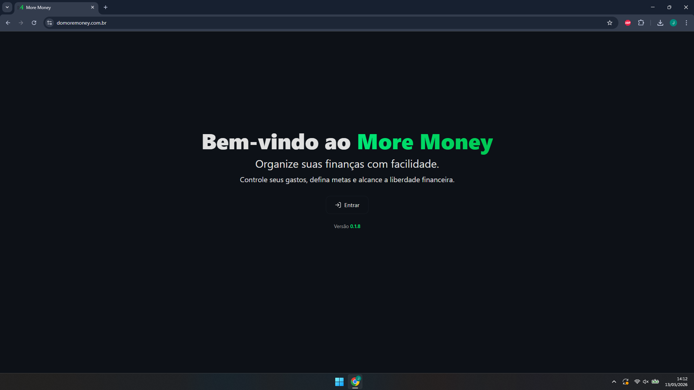
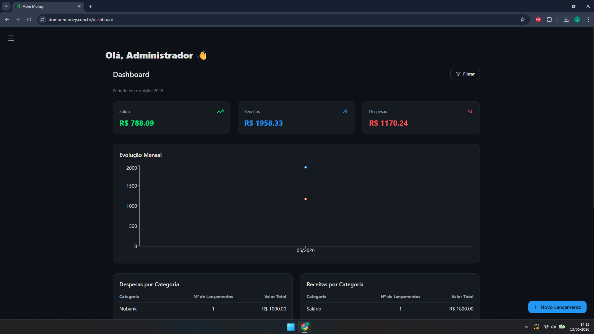
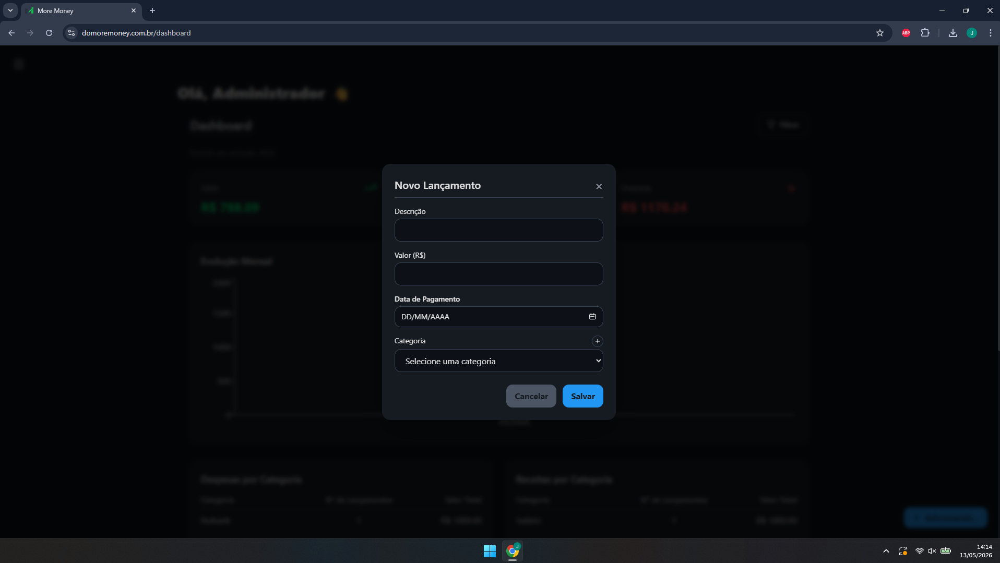
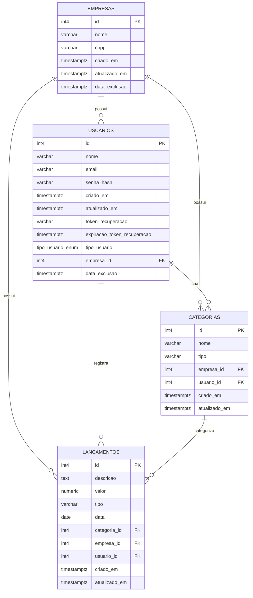

<div align="center">


### Organize suas finanças com facilidade.

Aplicação web de gerenciamento financeiro pessoal desenvolvida com foco em simplicidade, velocidade e experiência do usuário.

<br />

<a href="https://domoremoney.com.br/">
  
</a>

<a href="LICENSE">
  
</a>


</div>

---

# ✨ Sobre o projeto

O **More Money** é uma plataforma de controle financeiro pessoal desenvolvida para ajudar usuários a organizarem suas finanças de forma simples, rápida e intuitiva.

O sistema permite:

- Controle de receitas e despesas
- Visualização financeira em tempo real
- Dashboard com saldo consolidado
- Histórico de movimentações
- Organização por categorias
- Gestão financeira minimalista

O projeto foi desenvolvido com foco em:

- UX First
- Performance
- Interface limpa
- Facilidade de uso
- Fluxos rápidos
- Responsividade

---

# 🌐 Acesse o projeto

## Produção

👉 https://domoremoney.com.br/

---

<!-- # 📸 Preview do sistema

## 🔐 Login

```md

```

---

## 📊 Dashboard

```md

```

---

## 💸 lançamentos

```md

```

---

## 📜 Histórico financeiro

```md

```

--- -->

# 🚀 Funcionalidades

## ✅ Funcionalidades do MVP

- Cadastro de usuários
- Login e autenticação segura
- Dashboard financeiro
- CRUD de lançamentos
- CRUD de categorias
- Controle de receitas e despesas
- Histórico de movimentações
- Filtro por período
- Visualização de saldo
- Interface responsiva
- Sessões autenticadas com JWT

---

# 🎯 Público-alvo

- Estudantes
- Trabalhadores CLT
- Freelancers
- Autônomos
- Usuários iniciantes em finanças

---

# 🧠 Problema que o projeto resolve

Muitas pessoas possuem dificuldade em organizar suas finanças pessoais utilizando ferramentas simples e acessíveis.

Grande parte das soluções existentes são:

- Complexas
- Burocráticas
- Poluídas visualmente
- Pouco intuitivas

O More Money foi criado para oferecer uma experiência financeira mais simples, moderna e objetiva.

---

# 🛠️ Stack utilizada

## Frontend

- Next.js
- React
- TailwindCSS

## Backend

- API Routes (Next.js)
- NextAuth.js

## Banco de dados

- PostgreSQL
- SQL puro

## Infraestrutura

- Vercel

## Autenticação

- JWT
- NextAuth
- Criptografia de senhas

---

# 🗄️ Arquitetura do banco de dados

O projeto utiliza PostgreSQL com consultas SQL puras.

Exemplo de importação utilizada:

```ts
import { query } from "@/lib/db";
```

---

# 🧩 Diagrama do banco de dados

O banco de dados foi modelado utilizando PostgreSQL e hospedado no Supabase.

A estrutura atual do sistema possui relacionamento entre:

- Usuários
- Empresas
- Categorias
- Lançamentos

---

## 📌 Diagrama ER



---

# 🧱 Modelagem SQL atual

## 🏢 Tabela Empresas

```sql
CREATE TABLE "Empresas" (
    id SERIAL PRIMARY KEY,
    nome VARCHAR(255) NOT NULL,
    cnpj VARCHAR(20),
    criado_em TIMESTAMPTZ DEFAULT NOW(),
    atualizado_em TIMESTAMPTZ DEFAULT NOW(),
    data_exclusao TIMESTAMPTZ
);
```

---

## 👤 Tabela Usuarios

```sql
CREATE TYPE tipo_usuario_enum AS ENUM ('ADMIN', 'USUARIO');

CREATE TABLE "Usuarios" (
    id SERIAL PRIMARY KEY,
    nome VARCHAR(255) NOT NULL,
    email VARCHAR(255) UNIQUE NOT NULL,
    senha_hash VARCHAR(255) NOT NULL,
    criado_em TIMESTAMPTZ DEFAULT NOW(),
    atualizado_em TIMESTAMPTZ DEFAULT NOW(),
    token_recuperacao VARCHAR(255),
    expiracao_token_recuperacao TIMESTAMPTZ,
    tipo_usuario tipo_usuario_enum NOT NULL DEFAULT 'USUARIO',
    empresa_id INT,
    data_exclusao TIMESTAMPTZ,

    CONSTRAINT fk_empresa_usuario
        FOREIGN KEY (empresa_id)
        REFERENCES "Empresas"(id)
);
```

---

## 🗂️ Tabela Categorias

```sql
CREATE TABLE "Categorias" (
    id SERIAL PRIMARY KEY,
    nome VARCHAR(255) NOT NULL,
    tipo VARCHAR(20) NOT NULL,
    empresa_id INT,
    usuario_id INT,
    criado_em TIMESTAMPTZ DEFAULT NOW(),
    atualizado_em TIMESTAMPTZ DEFAULT NOW(),

    CONSTRAINT fk_empresa_categoria
        FOREIGN KEY (empresa_id)
        REFERENCES "Empresas"(id),

    CONSTRAINT fk_usuario_categoria
        FOREIGN KEY (usuario_id)
        REFERENCES "Usuarios"(id)
);
```

---

## 💸 Tabela Lancamentos

```sql
CREATE TABLE "Lancamentos" (
    id SERIAL PRIMARY KEY,
    descricao TEXT,
    valor NUMERIC(10,2) NOT NULL,
    tipo VARCHAR(20) NOT NULL,
    data DATE NOT NULL,
    categoria_id INT,
    empresa_id INT,
    usuario_id INT,
    criado_em TIMESTAMPTZ DEFAULT NOW(),
    atualizado_em TIMESTAMPTZ DEFAULT NOW(),

    CONSTRAINT fk_categoria_lancamento
        FOREIGN KEY (categoria_id)
        REFERENCES "Categorias"(id),

    CONSTRAINT fk_empresa_lancamento
        FOREIGN KEY (empresa_id)
        REFERENCES "Empresas"(id),

    CONSTRAINT fk_usuario_lancamento
        FOREIGN KEY (usuario_id)
        REFERENCES "Usuarios"(id)
);
```

---

# ⚙️ Como executar o projeto

## 1. Clone o repositório

```bash
git clone https://github.com/devpetry/more-money.git
```

---

## 2. Acesse a pasta do projeto

```bash
cd more-money
```

---

## 3. Instale as dependências

```bash
npm install
```

---

## 4. Configure o ambiente

Crie um arquivo `.env` na raiz do projeto:

```env
NEXTAUTH_URL=http://localhost:3000
NEXTAUTH_SECRET=

RESEND_API_KEY=

DB_USER=
DB_HOST=
DB_DATABASE=
DB_PASSWORD=
DB_PORT=
```

---

## 5. Configure o banco PostgreSQL

1. Crie um banco PostgreSQL localmente
2. Execute os scripts SQL acima
3. Configure as variáveis do `.env`

## 6. 🧪 Dados iniciais (seed)

Para facilitar o primeiro acesso ao sistema, é necessário criar um usuário administrador manualmente.

### 👤 Usuário padrão

- Email: admin@moremoney.com
- Senha: definida manualmente via hash bcrypt
```sql
INSERT INTO "Usuarios" (
    nome,
    email,
    senha_hash,
    tipo_usuario,
    criado_em,
    atualizado_em
) VALUES (
    'Administrador',
    'admin@moremoney.com',
    '$2b$10$COLE_AQUI_O_HASH_DA_SENHA',
    'ADMIN',
    NOW(),
    NOW()
);
```

---

## 7. Execute o projeto

```bash
npm run dev
```

---

# 📂 Estrutura do projeto

```txt
src/
├── app/
│   ├── api/
│   ├── (screens)/
├── components/
├── lib/
├── schemas/
├── styles/
└── api/
```

---

# 📈 Roadmap

## 🔜 Próximas funcionalidades

- O sistema atualmente permite criação de usuários apenas via perfil de administrador.
  Planeja-se implementar uma funcionalidade de **auto-cadastro (sign up)**, com uma tela pública de "Cadastre-se", permitindo que novos usuários criem suas próprias contas.

---

# 🎨 Design e experiência

O projeto foi desenvolvido priorizando:

- Interface minimalista
- Navegação intuitiva
- Performance
- Poucos cliques
- Responsividade
- Experiência moderna

---

# 📌 Status do projeto

| Status | Descrição |
|---|---|
| ✅ MVP concluído | Primeira versão funcional disponível |
| 🚧 Em evolução | Novas funcionalidades em desenvolvimento |

---

# 👨‍💻 Autor

## João Augusto Petry

Desenvolvedor Full-Stack e estudante de Engenharia de Software.

### Contato

- GitHub: https://github.com/devpetry
- LinkedIn: https://www.linkedin.com/in/joopetry/

---

# 📄 Licença

Este projeto está sob a licença MIT.

Consulte o arquivo `LICENSE` para mais informações.

---

<div align="center">

### More Money © 2026

Desenvolvido por João Augusto Petry.

</div>


